# Практическое руководство по сборке ламинарного бокса

 

### Данное руководство представлено для тех, кто ознакомлен с альтернативными способами снижения уровня контаминации, решил, что ламинарный бокс ему точно необходим, и готов инвестировать в оборудование. <b>Руководство неидеально (v.0.1), может содержать ошибки и, как и его читатель, будет совершенствоваться.</b>

\* Само по себе <b>Обладание ламинарным боксом</b> не гарантирует решение всех проблем и снижение уровня контаминации.

  

## <b>1. Рассчет мощности вентилятора</b>

[Рассчитываем мощность радиального вентилятора, в соответствии с сопротивлением предфильтра и HEPA-фильтра](https://youtu.be/MmqCsO1DsY0?t=365)

\* В дальнейшем тут будет подробное описание рассчетов

  
## <b>2. Закупка комплектующих</b>

| №  | Наименование  | Характеристики | UA | RF | EMEA | USA |
|---|---|---|---|---|---|---|
| 1 | HEPA-фильтр  | 1000х600мм  |   |   |   |   |
| 2 | Вентилятор   |   | [Купить](https://turbovent.com.ua/p1130397844-ventilyator-radialnyj-turbovent.html)  |   |   |   |
| 3 | Фанера  | Толщина 15мм  | [Купить](https://epicentrk.ua/ua/shop/fanera-fk-vlagostoykaya-1250x2500x15-mm-sort-3-4.html)  |   |   |   |
| 4 | Саморезы по дереву  | Длина 30мм  | [Купить](https://epicentrk.ua/ua/shop/samorez-po-derevu-potay-3x30-mm-200-sht-stal-chernyy-amig.html)  |   |   |   |

  
## <b>3. Спецификации компонентов</b>

  

## <b>3.1 HEPA-фильтр </b>

  

## <b> 3.2 Вентилятор </b>

|   |  |  |
|---|---|---|
| 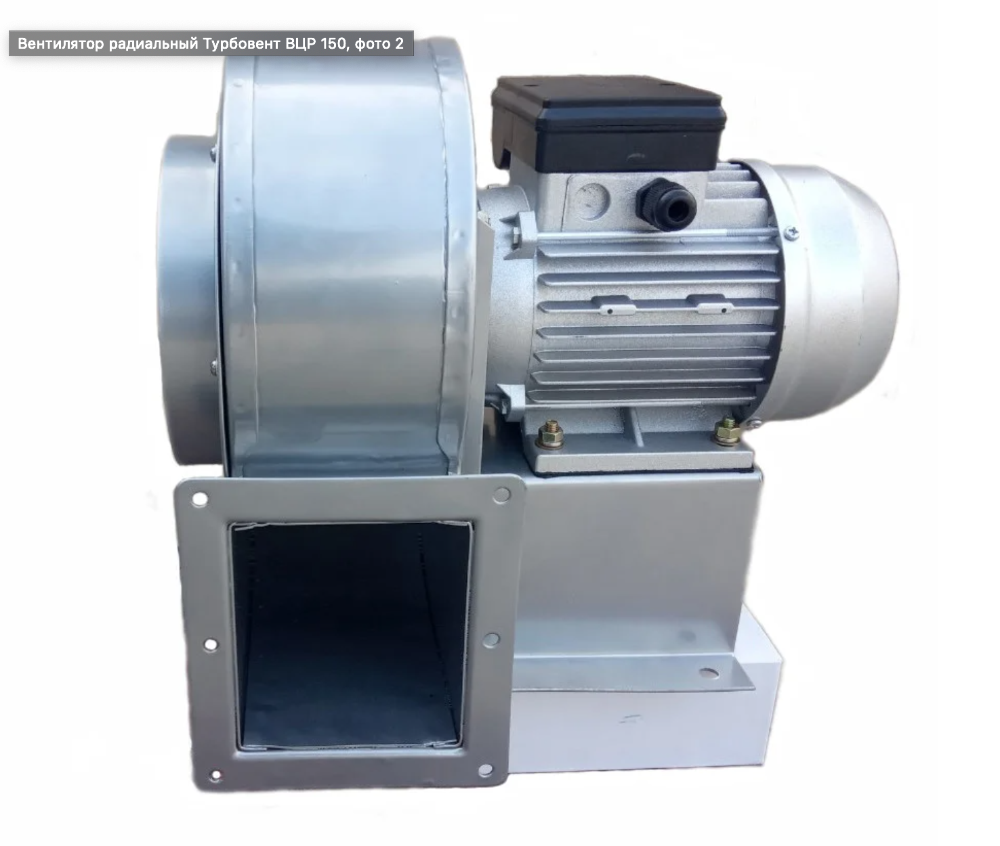  | 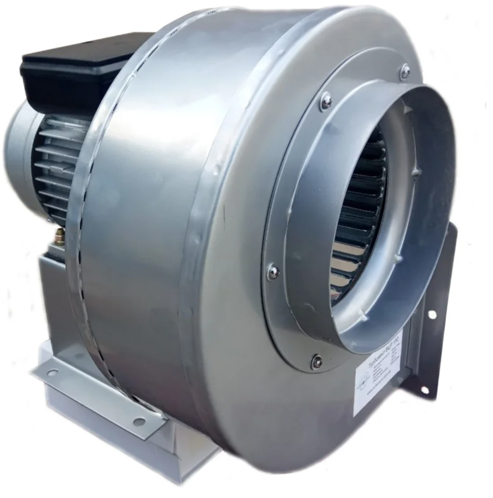  | 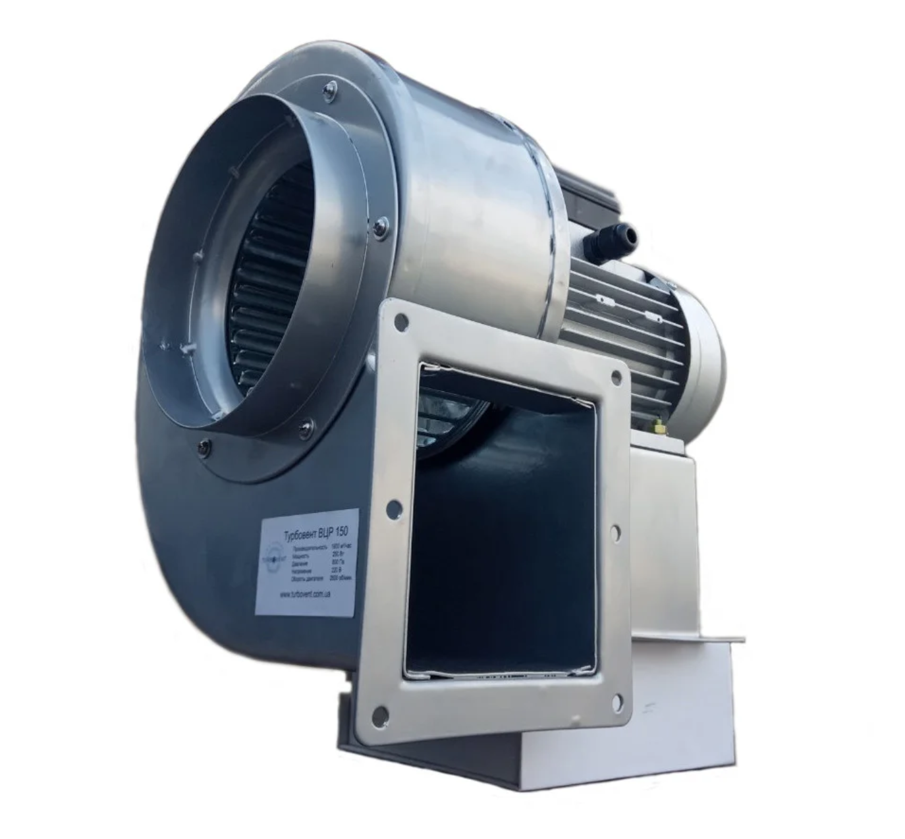 |

 

### <b>Характеристики вентилятора </b>

|   |   |
|---|---|
|Расход воздуха  	|1900 куб. м/час|
|Скорость вращения	|2800 об/мин|
|Потребляемая мощность  	|250 Вт|
|Напряжение сети  	|220~240 В|
|Вес	|10 кг|
|Материал корпуса	|Сталь|
|Высота	|350 мм|
|Ширина	|355 мм|
|Глубина	|330 мм|
|Требуемый диаметр воздуховода	|150 мм Подробнее: https://turbovent.com.ua/p1130397844-ventilyator-radialnyj-turbovent.html|

 

 

### <b>Чертеж вентилятора </b> (инвертированный по Y (вертикали), то есть мотор находится над, а не под выходом воздуховода)
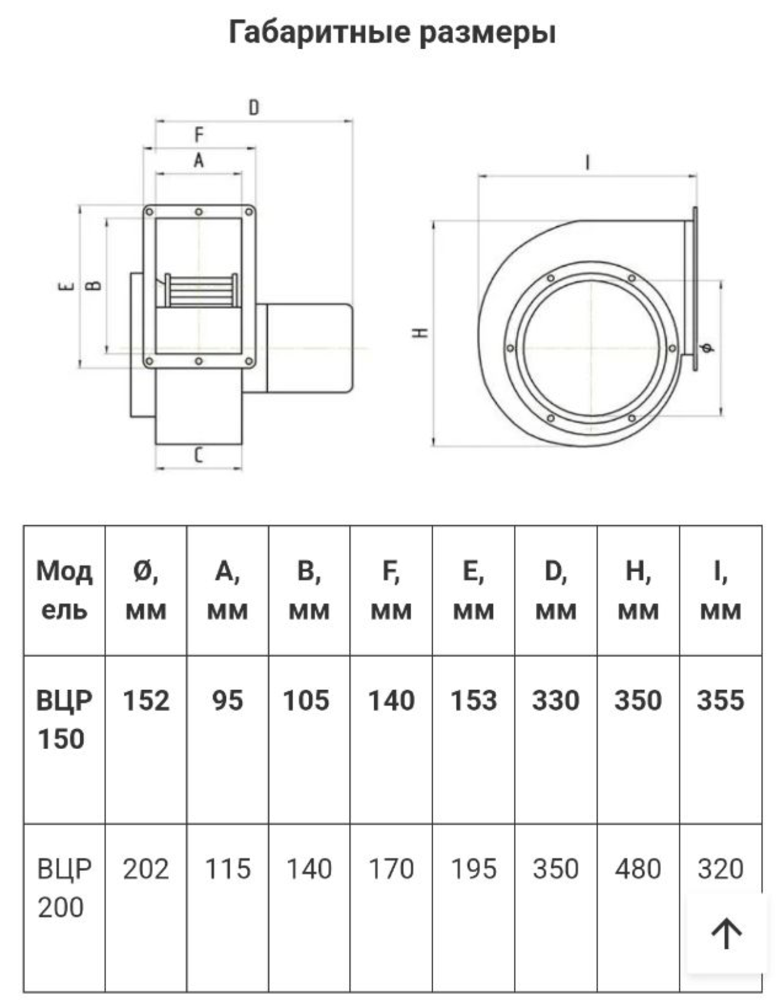

  

## <b>4. Изготовление необходимых детали из фанеры</b>
 

### Устройство состоит из двух боксов. Ламинарного и предфильтра.

    Материал - фанера 15мм
### Распил удобнее произвести у продавца материала по предоставленной ниже спецификации

| №: |  Деталь | Размеры, мм  | Количество, шт  |
|---|---|---|---|
|1 | Основание ламинарного бокса | 1030х515 | 1  |
|2 | Боковые панели ламинарного бокса  | 630х500  | 2  |
|3 | Задняя крышка ламинарного бокса  | 1030х630  | 1  |
|4 | Ребра жесткости ламинарного бокса (установлены за хепа-фильтром)  | 1000x30  | 2  |
|5 | Верхняя крышка ламинарного бокса  | 1000х500   | 1   |
|6 | Отверстие верхней крышки  | 105х95  | 1 |
|7 | Расстояние от отверстия верхней крышки до задней стенки  | 72.6мм  | n/a  |
|8 | Прокладка под вентилятор из резины толщиной 2мм  | 140х153 | 1  |
|9 | Отверстие в прокладке под вентилятор  | 105х95  | 1  |
|10| Передняя и задняя стенки предфильтра  | 543.9x450  | 2   |
|11| Боковые стенки  предфильтра  | 458x450 | 2  |
|12| Верхняя крышка предфильтра  | 544х487.6 | 1  |

   
## <b>5. Сборка:</b>

 

### <b>5.1 Все детали отшлифовать орбитальной шлиф-машиной шкурой 100-400 грип</b>

 

### <b>5.2 Все детали промазать масло-воском со всех сторон и дать высохнуть. (если не принято решение красить)

 

### <b>5.3 Собрать короб ламинарного бокса на саморезы, вкрученные в торец (перед вкручиванием саморезов, отверстия засверлить сверлом меньшего диаметра, чтобы предотвратить растрескивание фанеры)

 

### <b>5.4 Убедиться, что хепа-фильтр становится в посадочное место

 

### <b>5.5 Выставить хепа-фильтр по-глубине в коробе. Сзади него прикрутить два ребра жесткости

 

### <b>5.6 Предфильтр отложить в сторону, чтоб не забился пылью от работы

 

### <b>5.7 Убедиться, что вентилятор становится на указанное место.

 

### <b>5.8 Вырезаnm в верхней панели отверстие для установки вентилятора

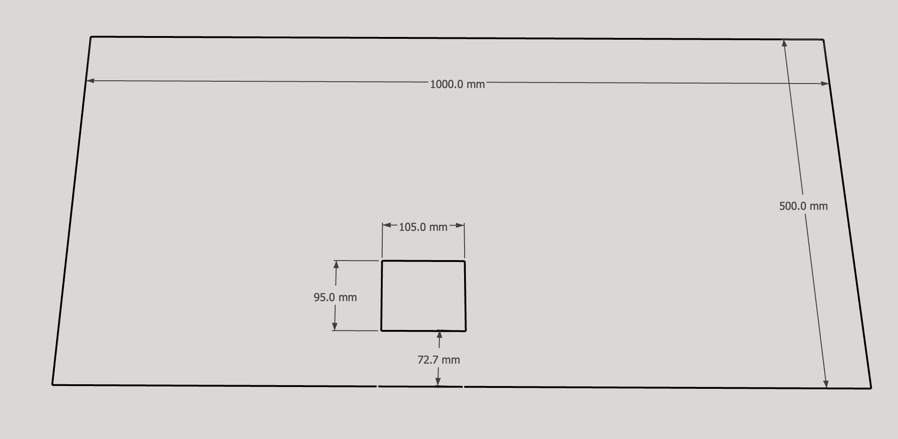

 

### <b>5.9 Вырезать из резины толщиной 2мм прямоугольник с отверстием, который послужит демпфером крепления вернтилятора. 
    
    Внешний размеры: 153х140
    Внутренний размер (отверстия): 105х95
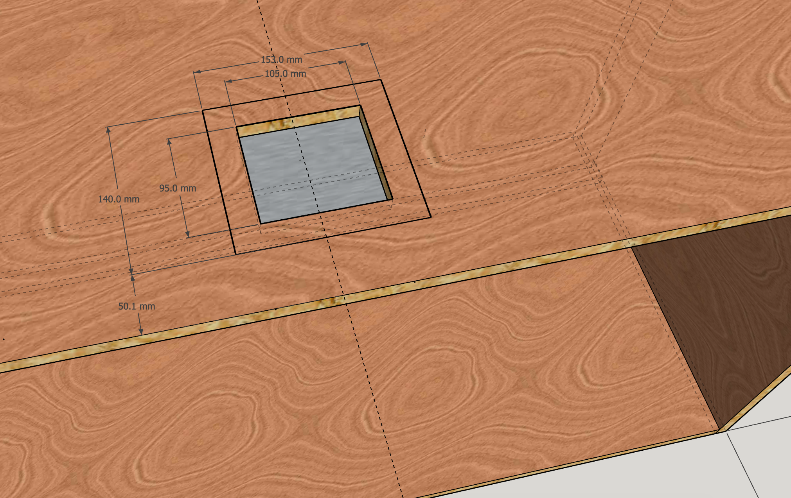

 

### <b>5.10 Приклеиваем эластичным клеем демпферную резинку к корпусу ламинарного бокса.

 

### <b>5.11 Устанавливаем части короба предфильтра:</b>
    
    Боковые панели: 457.6x450
    Задняя и передняя панели: 543.9х450

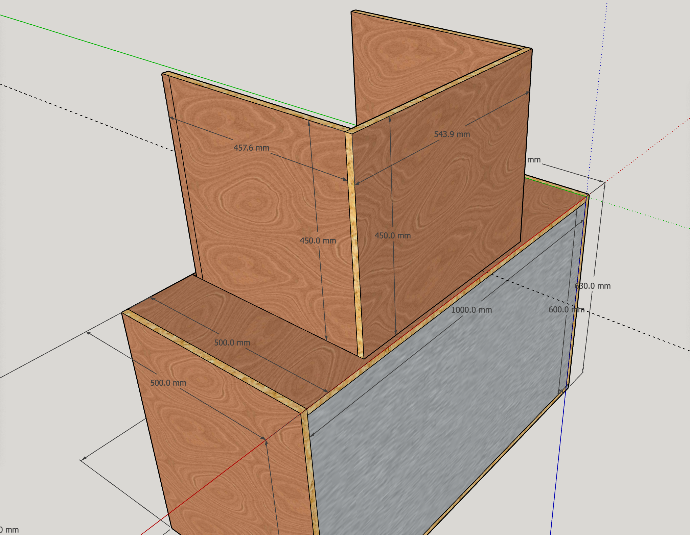

 

### <b>5.12 Красим все части снаружи и изнутри (если не было принято решение пропитывать масло-воском).

 

### <b>5.13 Устанавливаем вентилятор:
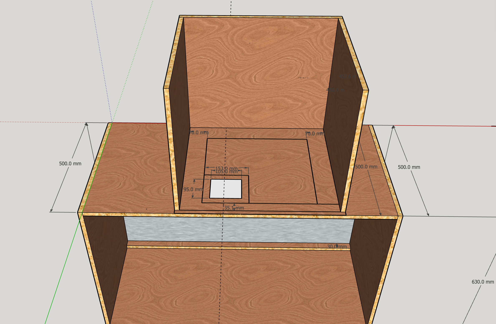

 

### <b>5.14 Устанавливаем заднюю крышку мотора
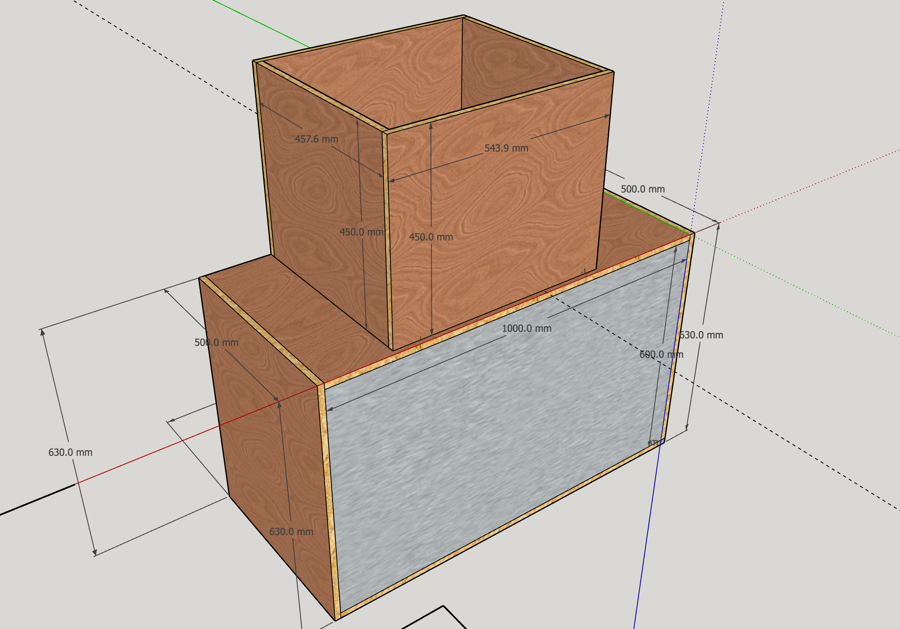

 

### <b>5.15 Устанавливаем верхнюю крышку предфильтра:

    Размеры: 543.9x487.6
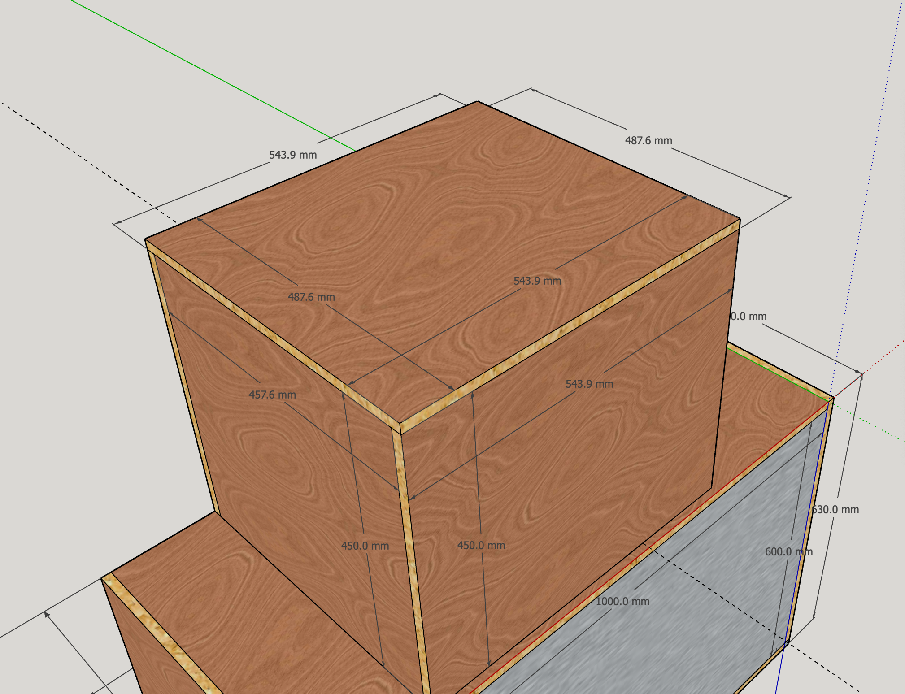

 

### <b>5.16 Сверлим отверстие для кабеля питания, соединяем провода, устанавливаем тумблер вкл/выкл (с таймером выключения, по желанию)

 

### <b>5.17 Устанавливаем заднюю крышку ламинарного бокса:

        Размеры: 1030х630

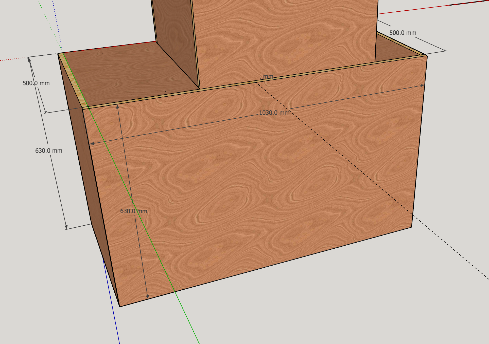

 

### <b>5.17 Устанавливаем хепа-фильтр. 

 

### <b>5.18 Используя доступный уплотнитель, проклеиваем щели за хепа-фильтром

 

### <b>5.19 Устанавливаем заднюю крышку ламинарного бокса

 

### <b>5.20 Радуемся пункту 4-20 и новенькому ламинарному боксу на столе.

  

\* Если вы встретили ошибку в данном руководстве, хотите предложить свой вариант чертежа, способ удешевления или улучшения конструкции,  гайд эксплуатации - дайте мне знать.